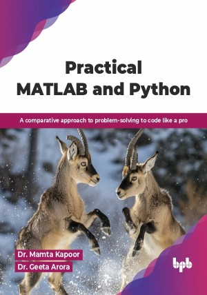

# Practical MATLAB and Python

A comparative approach to problem-solving to code like a pro.

This is the repository for [Practical MATLAB and Python
](https://bpbonline.com/products/practical-matlab-and-python?variant=44827522171080),published by BPB Publications.

## About the Book
MATLAB and Python are the two powerhouse languages for engineers, scientists, and data analysts, essential for numerical computing, simulation, and analysis. MATLAB is highly used to tackle scenarios such as signal processing, thermal simulations, structural analysis, modeling of mathematical systems, etc. On the other hand, Python has its own demand in different fields, such as data analysis, data visualization, machine learning, statistical modeling, classification models, regression models, quantitative analysis, etc.

This book develops an understanding of how MATLAB and Python can be used in parallel ways to deal with coding problems. A deep understanding of several concepts is provided via MATLAB and Python, such as variables and data types, basic operations, control flow and structures, functions, data handling, plotting and visualization, signal processing, image processing, etc. With the help of several hands-on examples, readers will be able to gain practical insights and will also be able to tackle real-life problems. 

By the end of this book, readers will be able to have confidence to code in MATLAB and Python, along with an understanding of the strengths of each tool. This book will give readers the ability to write efficient code, how to do data analysis, how to create visualizations, and how to deal with signal and image processing in an easy and efficient way.

## What You Will Learn
• Gain full insights about data handling and data visualization in MATLAB and Python.

• Knowledge about signal and image processing in MATLAB and Python.

• Apply coding skills to solve real-world problems.

• Selection of right language for specific coding tasks.

• Compare matrices, lists, tuples, and cell arrays.

• Execute matrix operations and advanced string handling.

• Implement conditional logic and iterative loop structures.

• Implement signal and image processing with OpenCV and libraries.
